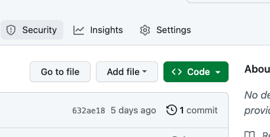

# Sample Application to help QA Team understand Cucumber testing in Java Spring Boot Applications

### Prerequisites 
* The Intellij Ultimate Edition is my preferred IDE, but it requires license
  * The Intellij Community Version doesn't have full spring boot support
  * VSCode is a free option and Eclipse is another paid option
* Later on, you will need Java 17, but you can pull that in using Intellij; see below (only know about Intellij)
  * Often Java applications expect JAVA_HOME to be certain version
    * To find out, type the following at the command line (minus the $)
    ```$ echo $JAVA_HOME```
  * To switch to another version super-easily, you can follow the following instructions:
    ```
    #!/bin/bash

    echo "$1"

    if test "$1" == "v17"
    then
       echo '-v17'
       export JAVA_HOME=$(/usr/libexec/java_home -v17)
    else
       echo '-v11'
       export JAVA_HOME=$(/usr/libexec/java_home -v11)
    fi
    ```
  * copy above code into a plain text editor.  Call it whatever.sh into whatever directory you want
  * If you want a different version, you may have to add another if
  * call it by (minus the $) ```$ bash ~/your_path/your_filename.sh v17```
  * <strong>Note - </strong> ~/ is a short-cut to your home directory

### Step 1 - Pull down data from Github 
* SSH support is way easier for github, here is a [github link about ssh](https://docs.github.com/en/authentication/connecting-to-github-with-ssh/about-ssh)
  * On the repository home page there is green code button to get the url 
  * Click the Code button
<p align="center">

</p>

  * Make sure you get the ssh option (click pages image to copy url)
  * Go to your terminal and cd to the directory where your code lives (mine is ~/development)
  * In terminal: $ cd ~/your_directory
  * In the above directory, type <strong>git clone</strong> and the copied url follows git clone 
  ```
     $ git@github.com:lizschley/spring-qa-testing-app.git 
  ``` 
* cd spring-qa-testing-app (unless you named your folder something else). App should be there.
### Step 2 - Run applications and tests in Intellij
1. In Intellij menu: File/Open - navigate to spring-qa-testing-app and click open.  This will be your base directory
2. You need to give the run_postgres.sh file execute rights
* Find the terminal window in the spring-qa_testing-app directory
* At the commandline run: $ ls -l
* For run_postgres.sh, the far left column should say: -rwxr-xr-x 
* If it doesn't have an x in each section, run this: $ chmod +x run_postgres.sh
3. In terminal (same directory) run: $ ./run_postgres.sh 
4. You should now have a running docker container called qe-spring-postgres (should restart whenever you start your machine)
5. In Menu: File/project Structure - make sure you either have Java 17 OR load it using Intellij
6. Click Maven on the far right vertical menu.
* Click it to get a side vertical Maven tool area 
* Right underneath the word Maven there are two arrows in a circle.  Click that circle to load the necessary packages.
* Once the packages are loaded, you can check it by doing the following:
  * Click the > symbol to the left of spring_qa_testing_app
  * Click the > symbol to the left of Lifecycle
  * Double-click clean
     * The results of clean should say BUILD SUCCESS and the process should finish with exit code == 0
  * You can double-click validate and hopefully get the same result
  * Close the Maven Tool window by clicking Maven on the far right vertical menu (it is a toggle)
7. <strong>Note -</strong> When you start to run anything you will get a button to enable annotations (mentions Lombok), you need them enabled
8. Run the application:
* Go to file src/main/java/spring_qa_testing_app/SpringQaTestingApplication.java and open it
* Within the opened application file, click on one of the run options: once you run it once, it will be in the dropdown on the top-level toolbar
* Click <strong>Run</strong> on the bottom menu. If you then click the application name, it will show you the everything that happens in the setup
* You can see what the application does by using Postman.
9. Running the tests:
* Make sure the application is NOT running (click red square in the top-level toolbar to stop running application)
* Go to the file spring_qa_testing_app/src/test/java/spring_qa_testing_app/cucumber/cucumberglue/RunCucumberTest.java
* open the Run Cucumber test file and click the green arrow to the left of <strong>public class RunCucumberTest</strong>
* After that Run Cucumber tests will be in the dropdown in the toolbar
10. Have fun exploring and learning!
## Notes
* [Known Snyk vulnerability](https://snyk.io/blog/unsafe-deserialization-snakeyaml-java-cve-2022-1471/) (not a real problem, IMO)
* This is a learning tool only.  If this was a production application, I would have done many things differently.
